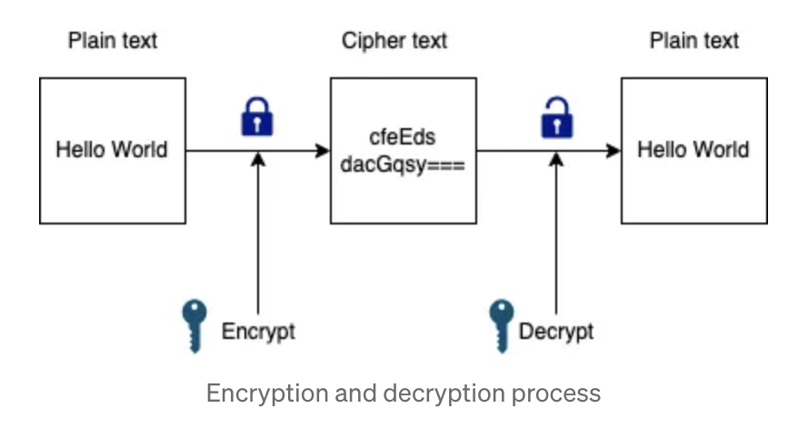

# Encryption Decryption

<figure><figcaption></figcaption></figure>

2 main types of encryption.

1. **`Symmetric`** encryption — same key is used to encrypt and decrypt data
2. **`Asymmetric`** encryption — two separate keys are used to encrypt and decrypt data

