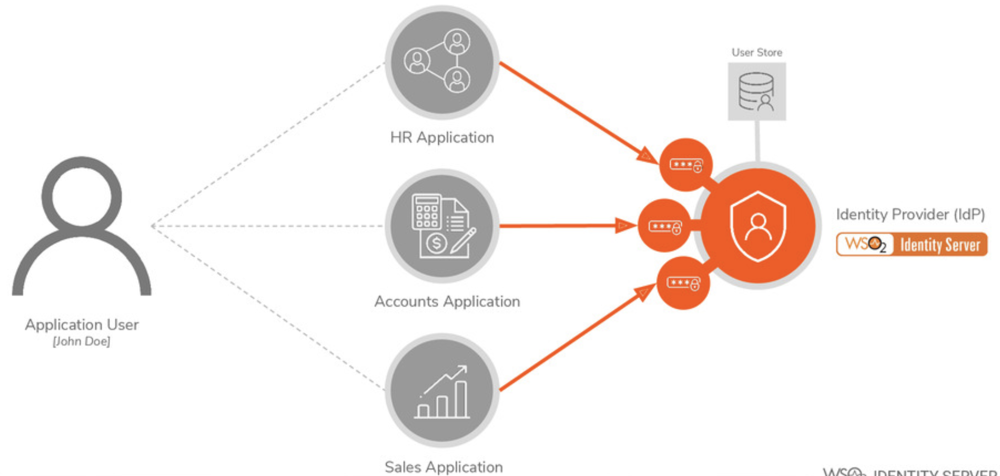
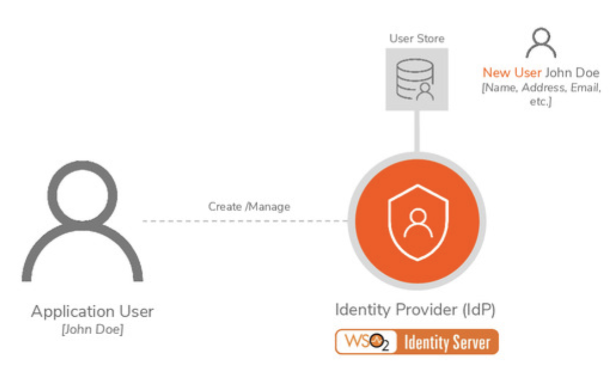
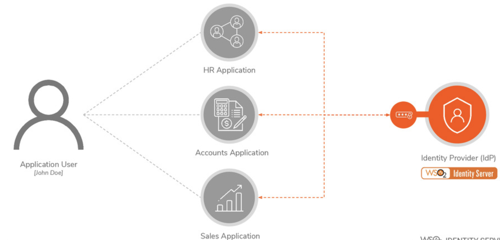
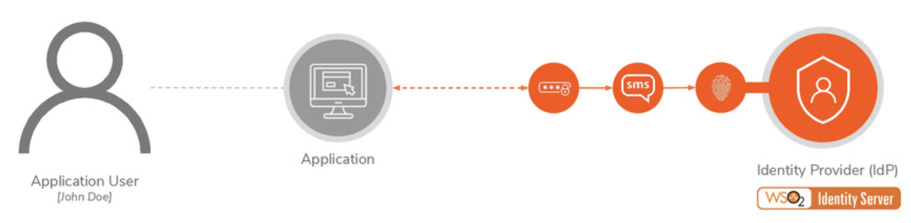
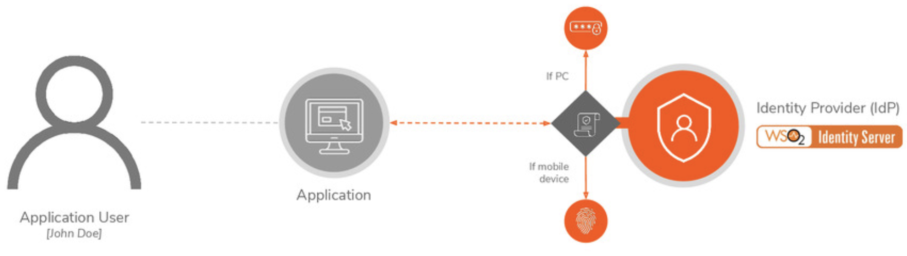
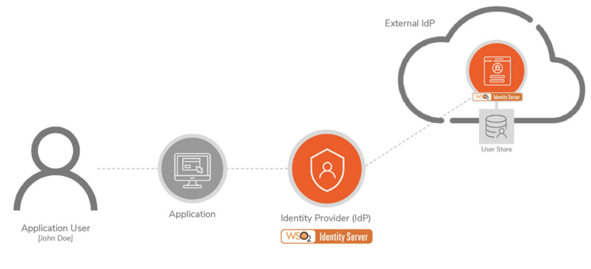
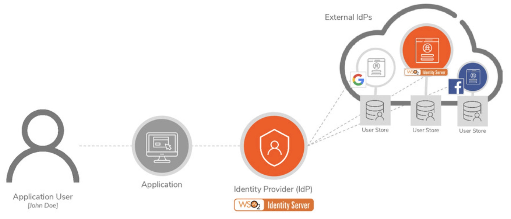

# IAM Concepts

## Centralized Access Management

> **Centralized Access Management**
>
> handles user authentication and account management at a **central system**&#x20;

<figure><figcaption></figcaption></figure>

## User Provisioning

> **User Provisioning**:
>
> creating and managing user accounts/identity information within the system

<figure><figcaption></figcaption></figure>

## `SSO`: Single Sign-On&#x20;

> **`SSO`: Single Sign-On**:
>
> authenticating users once and allowing access to other associated applications

<figure><figcaption></figcaption></figure>

## `MFA`: Multi Factor Authentication

> **`MFA`: Multi Factor Authentication**:
>
> authenticating users by challenging with multiple **authentication factors**&#x20;
>
> e.g: password, SMS, fingerprint

<figure><figcaption></figcaption></figure>

## Adaptive Authentication

> **Adaptive Authentication**:
>
> authenticating users by challenging with **multiple authentication steps** based on the **user's risk profile**

<figure><figcaption></figcaption></figure>

## Identity Federation

> **Identity Federation:**
>
> authenticating users existing in an **external identity provider (IdP)**

<figure><figcaption></figcaption></figure>

### Identity Federation with Social Login

> **Identity Federation with Social Login:**
>
> authenticating users using a social service provider as an external IdP

<figure><figcaption></figcaption></figure>

## Privacy and Regulatory Compliance

GDPR:

HIPAA:

PSD2:

California Consumer Privacy Act:

