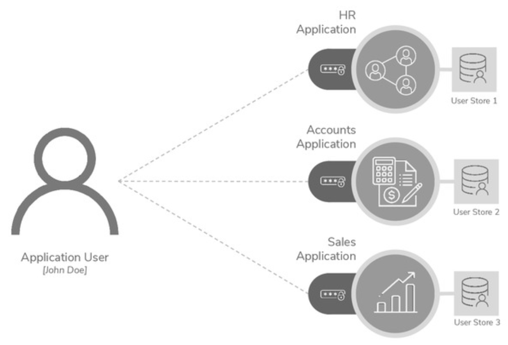

# Identity and Access Management

> **`IAM`: Identity and Access Management**:
>
> securely store and manage user identities and access privileges
>
> ╰**--**➤ ensure that users are who they claim to be and&#x20;
>
> ╰**--**➤ grant access only if they have the permission to access

enables&#x20;

* right individuals&#x20;
* to access the right resources&#x20;
* at the right time&#x20;
* for the right reasons

enable regulatory and privacy compliances

## Traditional Identity and Access Management

**`Application-Level Access Management`**: handles user authentication and account management at each application — traditional web app login

<figure><figcaption></figcaption></figure>

**Issues**:

* increased chance of data breaching&#x20;
  * due to use of simple passwords
  * due to use of same password for multiple applications
* minimum UX
  * having to remember multiple login credentials
  * different login experiences in different applications
* difficulty in governance&#x20;
* less agility and low productivity
* high IT costs
* difficulty in complying to regulations

