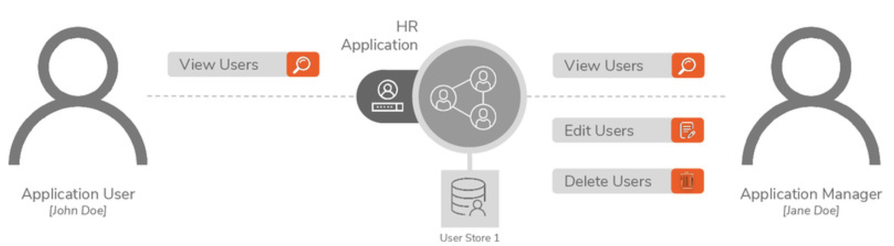
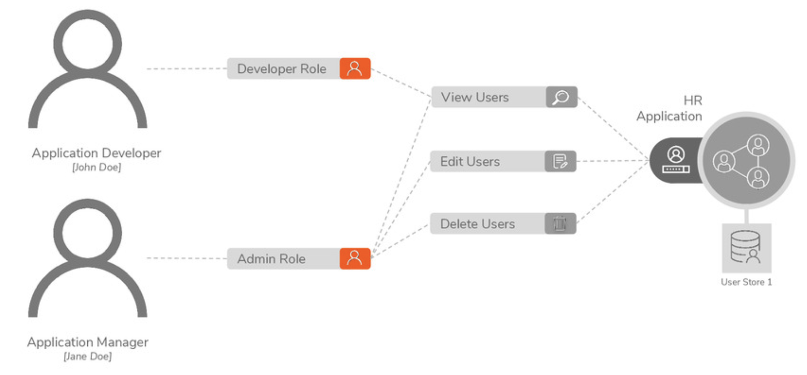

# Permissions & Roles

## Permissions

> **Permissions**:
>
> the actions the users are authorized to perform

<figure><figcaption></figcaption></figure>

## User Roles

> **User Roles**:
>
> a group of permissions that can be assigned to users depending on their job profile
>
> e.g: manager

<figure><figcaption></figcaption></figure>

