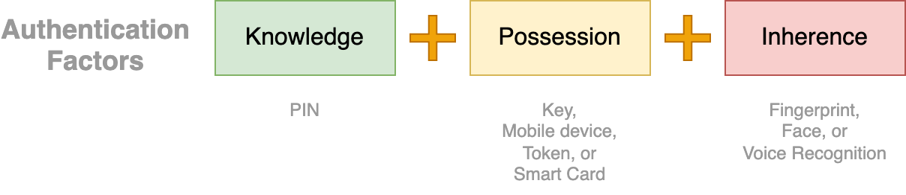
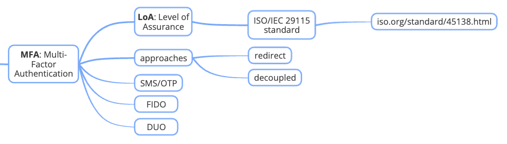

# SCA: Strong Customer Authentication

<figure><figcaption>
Strong Customer Authentication: Authentication Factors
</figcaption></figure>

## **`MFA`**: Multi Factor Authentication

<figure><figcaption></figcaption></figure>

* LoA - [ISO/IEC 29115 standard](https://www.iso.org/standard/45138.html)

### `LoA`: Level of Assurance

> **`LoA`: Level of Assurance**
>
> verifies the security level for customer authentication

4 Levels of Security Assurance

* Level 1: provides the lowest assurance
* Level 4: provides the highest assurance

