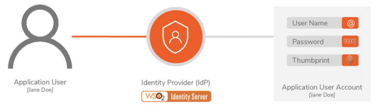
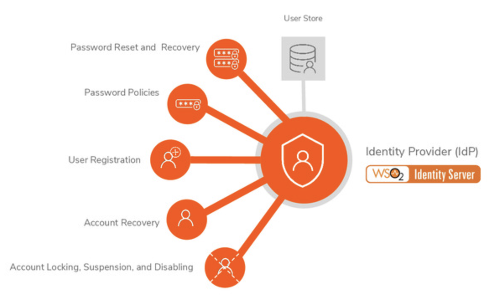
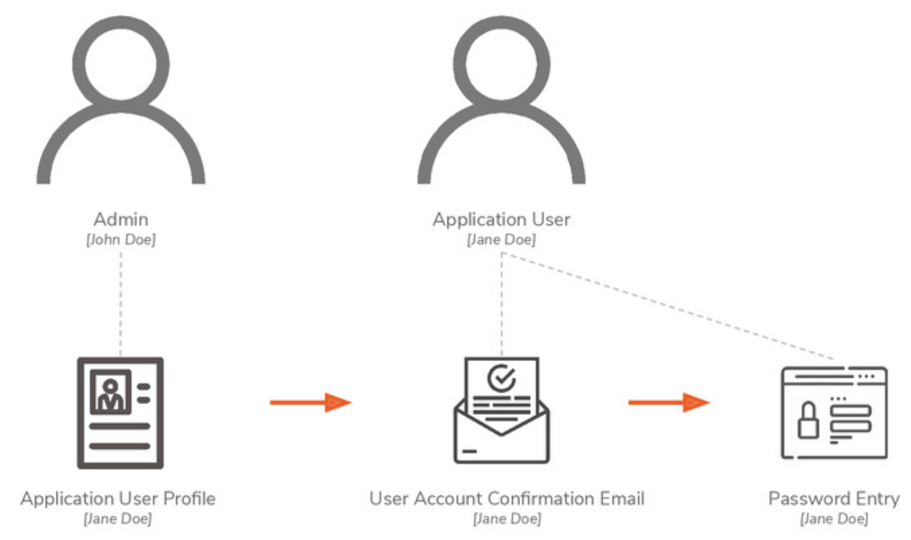
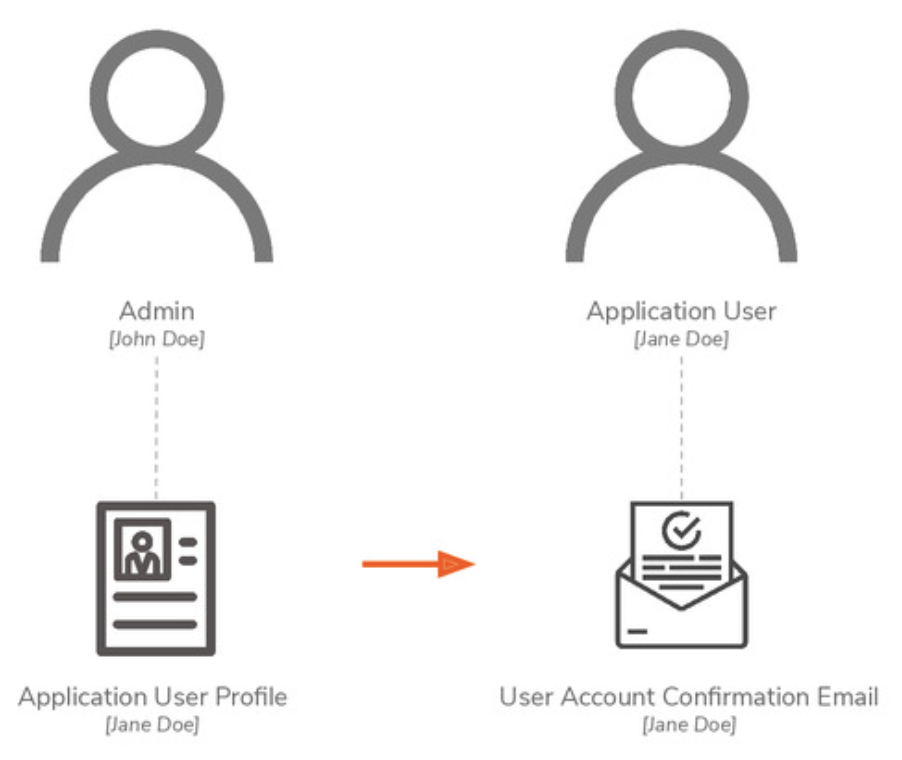
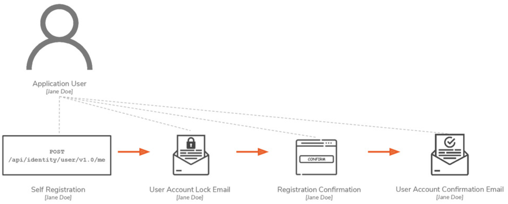
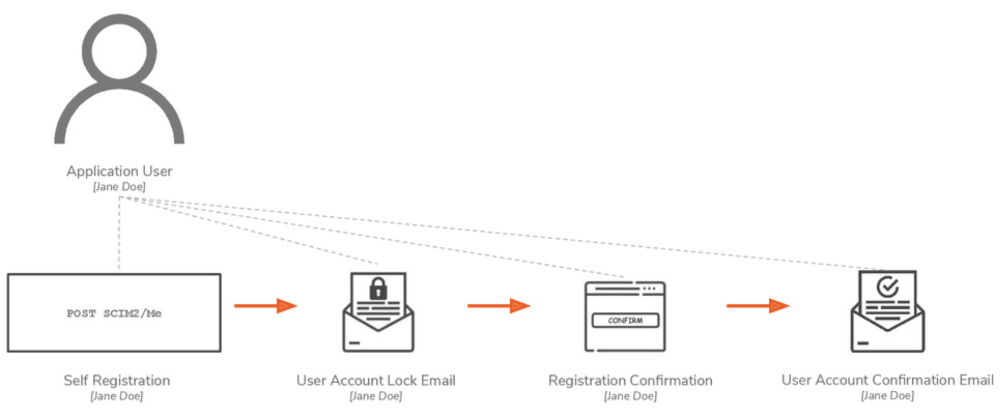

# User Account Management

<figure><figcaption></figcaption></figure>

<figure><figcaption></figcaption></figure>

* Password Reset and Recovery
* Password Policies
* User Registration
* Account Recovery
* Account Locking, Suspension, and Disabling

## User Registration

### User Registration with Password Entry

> **User Registration with Password Entry**:
>
> activating user account created by admins through password entry directed by confirmation email

<figure><figcaption></figcaption></figure>

### User Registration with Email Verification

> **User Registration with Email Verification**:
>
> activating user accounts created by admins through email verification

<figure><figcaption></figcaption></figure>

### Self-Registration with REST API

> **Self-Registration with REST API**:
>
> activating user accounts created by users via REST API

<figure><figcaption></figcaption></figure>

### Self Registration with SCIM2 API

> **Self Registration with SCIM2 API:**
>
> activating user accounts created by users via SCIM2 API

<figure><figcaption></figcaption></figure>
