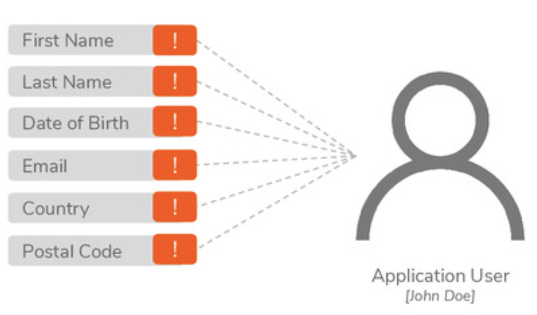

# User Management

* securely and efficiently manage user identities
* define and manage access rights
* grant the necessary access rights to users based on their authority

## User Claims

`User`: digital representation of a physical user who interacts with an application

> **`User Claims`**:&#x20;
>
> data that defines the user


anything&#x20;

* the user is,
* owned by, and&#x20;
* associated with


<figure><figcaption></figcaption></figure>

