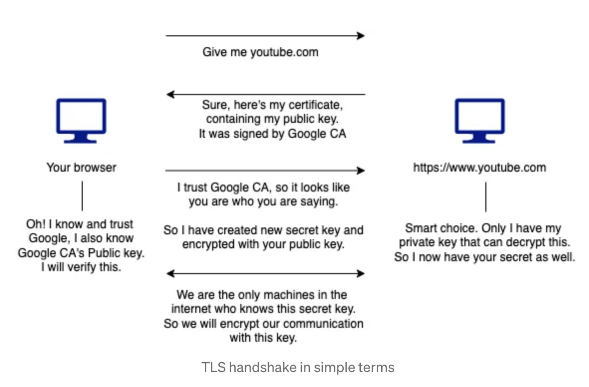

# HTTPS

security padlock icon or [HTTPS ](https://javarevisited.blogspot.com/2013/07/how-ssl-https-and-certificates-works-in-java-web-application.html)in your URL

* indicate that you have connected to a website that uses&#x20;
  * [SSL/TLS](https://javarevisited.blogspot.com/2022/02/top-5-courses-to-learn-ssl-and-tls-in.html) (Secure Socket Layer/Transport Layer Security) certificate and&#x20;
  * the secure TLS protocol
* ➤ known as **SSL/TLS handshake process**


```
client hello message
    - TLS version that the client supports
    - cipher suites supported; set of encryption algorithms for use in establishing secure communications connection
        - key exchange algorithm
        - a bulk encryption algorithm
        - a message authentication code algorithm
    - a string of random bytes known as the “client random”
```


## SSL/TLS handshakes&#x20;

1. The `“client hello”` message&#x20;
   * The client initiates the handshake by sending a “hello” message to the server.&#x20;
   * client hello message includes
     * **TLS version** that the client supports&#x20;
     * **cipher suites** supported; set of encryption algorithms for use in establishing secure communications connection&#x20;
       * key exchange algorithm&#x20;
       * a bulk encryption algorithm&#x20;
       * a message authentication code algorithm&#x20;
     * a string of random bytes known as the **“client random”**
2. The `“server hello”` message&#x20;
   * The server sends a message containing&#x20;
     1. the **server’s SSL certificate**
     2. the server’s **chosen cipher suite**&#x20;
     3. the **“server random”**; another random string of bytes that is generated by the server
3. `Authentication`&#x20;
   * The client **verifies the server’s** [**SSL certificate**](https://www.java67.com/2012/09/keytool-command-examples-java-add-view-certificate-ssl.html) **with the certificate authority (`CA`) that issued it**.
4. The `premaster secret`&#x20;
   * The client sends premaster secret
     * random string of bytes
     * **encrypted with the public key and can only be decrypted with the private key by the server**
       * The client gets the public key from the server’s SSL certificate
5. The `private key` is used&#x20;
   * The server **decrypts the `premaster secret`**
6. `Session keys` created&#x20;
   * Both **client and server generate session keys** from&#x20;
     * the client random,
     * the server random, and&#x20;
     * the premaster secret
7. The `client is ready`&#x20;
   * The **client sends a “finished” message** that is **encrypted with a session key**.
8. The `server is ready`
   * The **server sends a “finished” message encrypted with a session key**.
9. `Secure symmetric encryption achieved`
   * The handshake is completed, and the **communication continues using the session keys**.


### Example Scenario

browser: `Google Chrome`&#x20;

you want to log into `YouTube`

1. @Google chrome: type `https://www.youtube.com`&#x20;
   * say _**give me youtube**_
2. YouTube  -->  Google Chrome
   * sends,&#x20;
     * _**Sure**, **here’s my certificate**, **which contains my public key**._&#x20;
     * _**It was signed by google CA**._
3. @Google chrome:
   * says,&#x20;
     * _**Oh! I also know Google CA and I trust Google**._&#x20;
     * _**And I also have Google CA’s public key.**_&#x20;
     * _**So I will verify it.**_
   * verify the public key of You Tube
   * if verification success
     * says
       * `https://www.youtube.com` _**I trust Google CA and it seems that you are who you are saying to be.**_&#x20;
     * create a random secret key and encrypt it with You Tubes public key&#x20;
4. Google chrome --> You Tube
   * send&#x20;
     * _**Here, I have created a random secret key and encrypted it with the public key.**_
5. @You Tube
   * says&#x20;
     * _**Wow! Smart choice. I will decrypt it using my private key so that I can have your secret key.**_
   * decrypt the received Google Chrome's secret key with YouTube's secret key
6. Now both the browser and `https://www.youtube.com` are the only ones that have that `random secret key`.&#x20;
   * Therefore, they can share data by encrypting data using that secret key.

<figure><figcaption></figcaption></figure>


